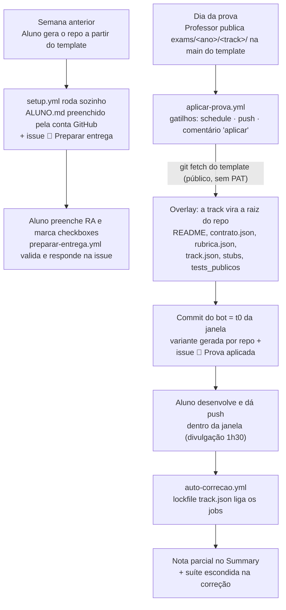

# exam-escola-ti — Sistema de provas (Escola de TI)

> [!IMPORTANT]
> Este é o **sistema de provas da Escola de TI** — modelo de repositório
> único: o esqueleto (issueops + correção) é estável e cada prova chega como
> pasta do ano (`exams/<ano>/<track>/`), aplicada por overlay no dia da prova.
> Material do docente (decisões, riscos, segredos, roteiros) vive no repo
> privado **`endersonmenezes/teacher-escola-ti`**, pasta `_docente/` — nada
> aqui é sigiloso.

## O modelo

Três camadas num único repositório **público**:

1. **Esqueleto ano-agnóstico** (sempre público): workflows (`setup`,
   `preparar-entrega`, `aplicar-prova`, `auto-correção`), scripts base,
   `docs/REGRAS.md`, `docs/TRACKS.md`, `FONTES.md`, READMEs.
2. **Tracks** (sempre públicas e estáveis): o *tipo* de prova — originadas da
   disciplina em `talks/courses/escola-de-ti` (SDD, debugging, CRUD fullstack).
   Hoje há a **track CRUD fullstack**: API com suíte de juiz **+ frontend** (o
   básico entra na nota; avanços rendem pontos extras).
3. **Exams** (`exams/<ano>/<track>/`): cada pasta é uma prova **única**, com
   ano de aplicação próprio, selecionada pelo issueops no dia da prova. O
   conteúdo da pasta **é o repositório do aluno** no momento da aplicação
   (overlay na raiz: README, `contrato.json`, `rubrica.json`, `track.json`,
   stubs, testes). O esqueleto fica por trás, sustentando o issueops.

> [!WARNING]
> **Aplicar a pasta de ano errado zera a prova** — cada `exams/<ano>/` só
> deve estar publicado na `main` durante sua aplicação. Anos anteriores
> permanecem no histórico do repo, sempre disponíveis para consulta e
> evolução das próximas provas.

> O `contrato.json` é o coração do modelo: por ser máquina-legível e detalhado,
> **a prova muda completamente de ano para ano mantendo apenas a track** —
> basta trocar a pasta do ano. O contrato **só existe após a aplicação**
> (`contrato.json` na raiz, vindo da pasta do ano) — a raiz do template é
> só esqueleto; o conteúdo de prova fica em `exams/` e é consumido pelo
> overlay (e validado pelo workflow *Validar exams* a cada push na main).

## O ciclo de vida de uma prova



- **Janela auto-ancorada**: a trampa T4 mede a janela a partir do commit
  "aplicar prova" + `janela_minutos` da rubrica — enforcement 120 min,
  divulgação 1h30.
- **Idempotência**: sentinela `.prova/aplicada-<pasta>` — o bot nunca aplica
  duas vezes.
- **Variante por repositório**: `scripts/variante.py` deriva os parâmetros do
  nome do repo + tabelas do `contrato.json` da pasta do ano; a correção
  recompute os mesmos valores.

## Configuração (uma vez)

| Onde | O quê |
| --- | --- |
| Repo → Settings → Variables | `TEMPLATE_URL` — default já aponta para `endersonmenezes/exam-escola-ti` |
| Repo → Settings → Secrets/Vars | `CORRECAO_TOKEN` (PAT read-only neste repo + repo de correção) e `TEMPLATE_REPO` — usados pelo tamper-check T3 |

`GITHUB_TOKEN` padrão basta para tudo o mais (repo público).

## Testar o ciclo completo (dummy)

O `exams/2026/dummy-exam/` é uma prova de teste de primeira classe: serve
para validar o sistema e pode ser usada pelo professor como **aula teste de
entrega** (todos os alunos fazem o ciclo com ela antes da prova real).

**Cenário A — você está em `endersonmenezes/` (dono do template):**
1. Crie um repo de teste: `gh repo create prova-teste-meu-login --template endersonmenezes/exam-escola-ti --private` (ou o botão "Use this template").
2. O `setup.yml` roda sozinho: `ALUNO.md` + issue "🎯 Preparar entrega". Complete o RA, marque os checkboxes — *Preparar entrega* responde na issue.
3. Comente "aplicar" na issue (ou aguarde o polling de 10 min): o *Aplicar prova* faz o overlay do dummy — `contrato.json` na raiz, README novo, `tests/public/` —, commita (t0 da janela) e abre a issue "📝 Prova aplicada" com a sua variante.
4. Implemente algo em `src/` + `Dockerfile`, dê push — *Auto-correção* roda com a janela ancorada e a nota sai no Summary.

Anos com mais de uma track publicada exigem seleção: o aluno comenta
`/track <nome>` na issue "🎯 Preparar entrega" antes da aplicação.

**Cenário B — você tem um fork e quer provar o sistema de ponta a ponta:**
1. Fork deste repo e registre a var `TEMPLATE_URL` apontando para **o seu fork**
   (Settings → Secrets and variables → Actions → Variables).
2. Em um repo gerado a partir do **seu fork**, siga os passos 2–4 do Cenário A.
3. O overlay vai puxar a pasta do ano da **sua** `main` — publique
   `exams/<ano>/<track>/` lá quando quiser simular o dia da prova, e observe o
   `aplicar-prova` disparar sozinho (ou force com "aplicar" na issue).

## Riscos conhecidos (resumo)

- **Schedules desativam após 60 dias** sem atividade no repo do aluno —
  mitigado pelos gatilhos `push`/`issue_comment` e por criar os repos perto
  da prova.
- Aluno com `git fetch` manual no template antes da hora descobre, no máximo,
  os próprios parâmetros — impacto baixo por desenho.
- Detalhes completos, segredos e roteiros: **`teacher-escola-ti/_docente/`**
  (repo privado do professor).

## Estrutura

```
├── .github/workflows/    setup, preparar-entrega, aplicar-prova, auto-correção
├── scripts/              variante (lê contrato.json), setup, preparar, aplicar,
│                         trampas (janela auto), nota (base + extras),
│                         track_lock, checks da track CRUD fullstack
├── docs/REGRAS.md        regras comuns (nota, janela, fontes, zeramento)
├── docs/TRACKS.md        lockfile track.json + guia de nova track (para LLM)
├── exams/2026/dummy-exam/  prova de teste (aula teste / validação do sistema)
│   ├── README.md         vira o README raiz do aluno (overlay)
│   ├── contrato.json     vira contrato raiz (endpoints, regras, frontend)
│   ├── rubrica.json      vira rubrica raiz (pesos, extras, janela)
│   ├── track.json        vira lockfile raiz (liga workflows — docs/TRACKS.md)
│   ├── tests_publicos.py vira tests/public/test_publicos.py
│   ├── Dockerfile, src/  stubs de entrega na raiz
│   └── AVISO-DUMMY.md    aviso interno (não vai para o repo do aluno)
├── tests/public/         placeholder — os testes chegam com a aplicação
├── _docente/             (gitignored) material do professor — vive no repo
│                         privado teacher-escola-ti
└── FONTES.md             declaração de consultas do aluno
```
